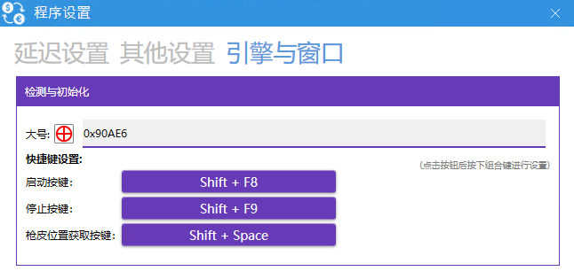
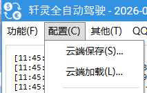
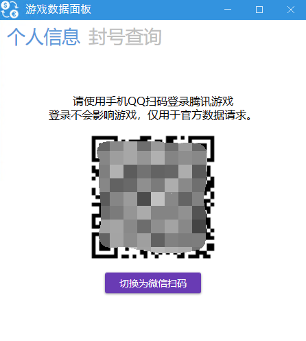
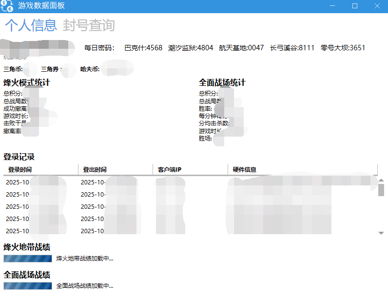
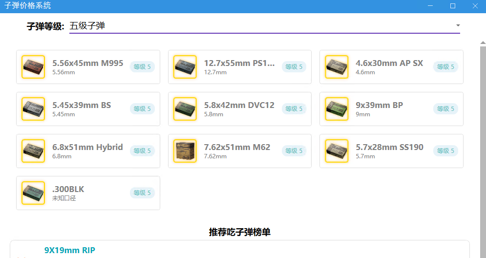

# 软件其他功能介绍

## 一、 配置信息保存与加载

* **云端保存** ：储存软件里你个人配置在云端（云端保存时会覆盖云端配置）。
* **云端加载** ：同步云端配置到本地，同步完成后点确定重启程序。（同步时会覆盖本地配置）。

## 二、 信息查询

* **个人信息**： 打开窗口后是需要使用QQ扫码登陆的。可以显示游戏数据信息、登录信息可以查看ip和设备，知道账号是否被盗登录。
* **封号查询**： 这个是单独也需要使用QQ扫码登陆，查看所有游戏封号信息。

## 三、 子弹价格系统与计算

* 可以点击任意子弹查看预计市场价，并且可以计算预计利润。